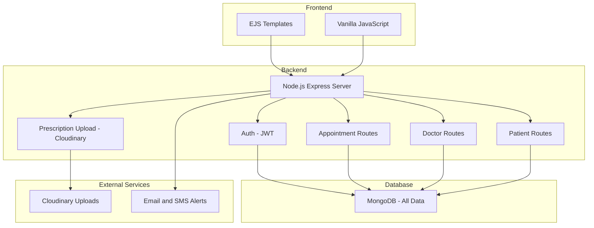

<div align="center">

# 🏥 Health India Now
### Simplified Healthcare Appointment Booking Platform for India

[](https://choosealicense.com/licenses/mit/)
[](https://nodejs.org/)
[](https://expressjs.com/)
[](https://mongodb.com/)
[](https://ejs.co/)

[🚀 Live Demo](https://health-indianow.vercel.app) • [🐛 Report Bug](https://github.com/roshanadhav/Health-Indianow/issues) • [💡 Request Feature](https://github.com/roshanadhav/Health-Indianow/discussions)

</div>

---

## 📋 Table of Contents

- [🎯 Overview](#-overview)
- [✨ Features](#-features)
- [🏗️ System Architecture](#-system-architecture)
- [🚀 Quick Start](#-quick-start)
- [⚙️ Installation](#️-installation)
- [📖 Usage](#-usage)
- [🔌 API Endpoints](#-api-endpoints)
- [🛠️ Future Plans](#-future-plans)
- [🤝 Contributing](#-contributing)
- [📄 License](#-license)

---

## 🎯 Overview

**Health India Now** is a simple and secure healthcare appointment booking system built for Indian clinics and hospitals. Patients can book doctor appointments, and doctors can manage their consultations — all from a clean dashboard.

Built with:
- 🖥️ **Frontend**: EJS + Vanilla JS
- ⚙️ **Backend**: Node.js + Express
- 🗃️ **Database**: MongoDB
- 🔒 **Auth**: JWT-based user login

---

## ✨ Features

### 👨‍⚕️ For Doctors
- Create and manage your profile
- Set available slots
- View booked appointments
- Upload prescriptions securely

### 🧑‍💻 For Patients
- Register/login with JWT
- Browse doctors by specialty
- Book appointments
- View past prescriptions

### 🔐 Admin (Basic Role)
- View users and doctors
- Monitor system usage
- Manage and verify doctors

---

## 🏗️ System Architecture



---

## 🚀 Quick Start

```bash
git clone https://github.com/roshanadhav/Health-Indianow.git
cd Health-Indianow
npm install
npm run dev
```

Visit `http://localhost:3000` to test locally.

---

## ⚙️ Installation

You’ll need:
- Node.js `v18+`
- MongoDB locally or [MongoDB Atlas](https://www.mongodb.com/cloud/atlas)

Create a `.env` file like this:

```env
PORT=3000
MONGO_URI=your_mongo_connection
JWT_SECRET=your_jwt_secret
CLOUDINARY_CLOUD_NAME=your_name
CLOUDINARY_API_KEY=your_key
CLOUDINARY_API_SECRET=your_secret
```

---

## 📖 Usage

- Register/Login as a patient or doctor
- Book appointments from patient dashboard
- Upload prescriptions from doctor panel
- Admin can monitor all activity (basic role)

---

## 🔌 API Endpoints

| Method | Endpoint               | Description                    |
|--------|------------------------|--------------------------------|
| POST   | `/api/register`        | Register a user (patient/doctor) |
| POST   | `/api/login`           | Login and receive JWT          |
| GET    | `/api/doctors`         | Get list of doctors            |
| POST   | `/api/appointments`    | Book an appointment            |
| GET    | `/api/user/appointments` | Fetch user's appointments    |
| POST   | `/api/prescriptions`   | Doctor uploads a prescription  |

---

## 🛠️ Future Plans

These are under development or planned for later releases:

- 📱 **Responsive Mobile UI**
- 🌐 **Multi-language Support**
- 📩 **Email + SMS Reminders**
- 🧑‍⚕️ **Doctor Verification Process**
- 📊 **Admin Analytics Dashboard**
- 💳 **Payment Gateway Integration**
- ⏰ **Calendar View for Appointments**
- 📦 **Docker Deployment**

---

## 🤝 Contributing

Contributions are always welcome!

```bash
1. Fork this repo
2. Create a new branch
3. Make changes
4. Submit a pull request
```

📩 For suggestions, [open an issue](https://github.com/roshanadhav/Health-Indianow/issues).

---

## 📄 License

This project is licensed under the [MIT License](https://choosealicense.com/licenses/mit/).

---

Made with ❤️ by [Roshan Adhav](https://github.com/roshanadhav)
